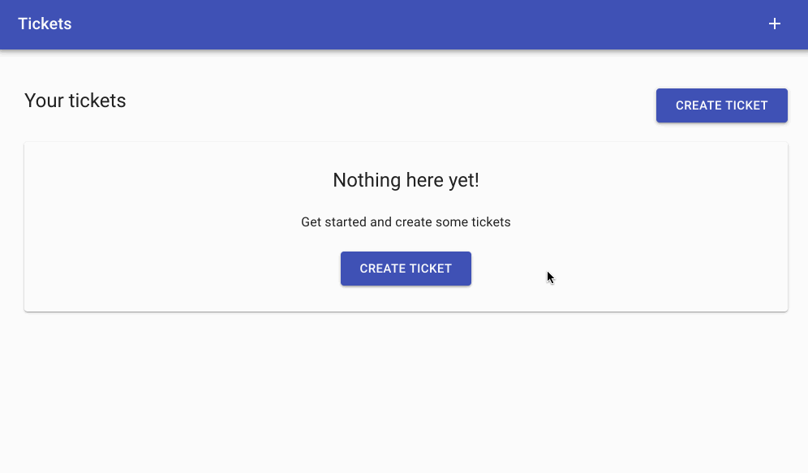

# Ticket Management

Create, Edit, Delete, Duplicate tickets and view ticket history in a simple ticket management system - all managed by the concepts of event sourcing.

## Overview



## Running

First ensure that you have your `.env` file set up with the correct environment variables:

```
cp .env.example .env
```

Running the containers:

```
docker-compose build
docker-compose up
```

Once running - in a new tab ensure that the database migrations have been applied:

```
docker-compose exec backend flask db upgrade
```

The following endpoints should now be available on your host machine:

- Backend - http://localhost:5000/graphql
- Frontend - http://localhost:3000/

## Backend Dev

The following technologies are used for the backend:

- [Graphene](https://graphene-python.org/) + [Flask](http://flask.pocoo.org/) - Used to build GraphQL API in Python
- [Eventsourcing](https://github.com/johnbywater/eventsourcing) - The heart of the API which tracks all state changes via domain events, and provides the means to reconstruct the application state either on demand, via snapshots, or projections
- [SqlAlchemy](https://www.sqlalchemy.org/) + [Flask Migrate](https://github.com/miguelgrinberg/Flask-Migrate) - Database ORM and migration support

The development flow consists of running the docker containers with `docker-compose up`. Any changes to the `backend/` folder
will cause an automatic reload of flask.

It is also possible to start a new shell into the backend process with:

```
docker-compose up
docker-compose exec backend /bin/sh
```

Running tests:

```
docker-compose up
docker-compose exec backend /bin/sh
pytest
```

### Migrations

To create migration scripts, ensure that you have added/upgraded your SqlAchemy db models then create a new migration with:

```
flask db migrate -m "add event sourcing table"
```

To apply changes to your database:

```
flask db upgrade
```

## Frontend Dev

The following technologies are used for the frontend:

- [React](https://reactjs.org/) - View layer
- [material-ui](https://material-ui.com/) - React components for faster and easier web development
- [Next.JS](https://nextjs.org/) - Server side rendering for React
- [Apollo](https://www.apollographql.com/) - GraphQL client with React integration

Running tests:

```
docker-compose up
docker-compose exec frontend /bin/sh
yarn test
```

For generating the latest TypeScript definitions for GraphQL queries:

```
yarn codegen:watch
```

Downloading the latest schema from the backend:

```
yarn schema:fetch
```